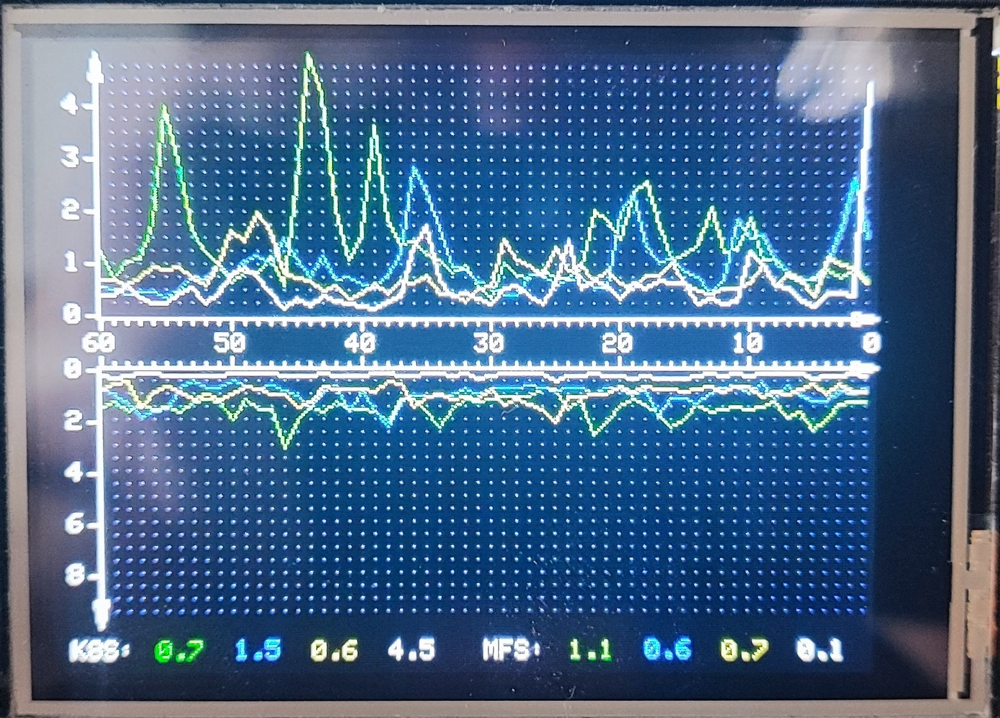

# CYD / TFT_eSPI 2 Graphs/4 Line charts for LoadAverage
This repo is provided as is as it was done for one of my personal projects.
Using CYD, TFT_eSPI, Elegant OTA and PubSub and RingBuffer we're getting ability of OTA updates, receiving messages (LA in my case) storing data in Ring buffer and plot two graphs containing 4 line charts of last 60 records (60 minutes in my case)

It is partially parametrized, but there is still some hardcode, which I might or might not fix in the future - feel free to tune it for your tase, or use it for your inspiration :D